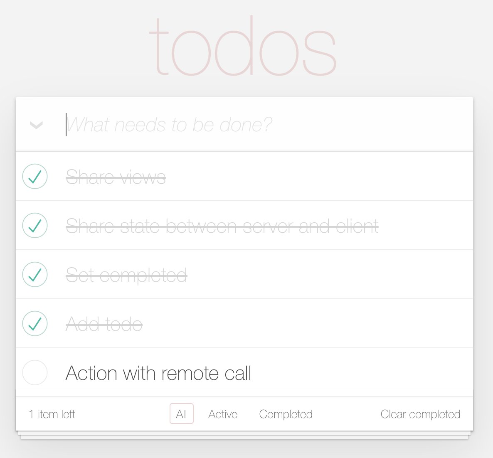

This project is a small prototype of a Kotlin multiplatform web application. 
The goal of this architecture is to have server generated pages, parsable 
by search engines, but also with client interactions. 

Rendering code is shared and used by server and client using 
[kotlinx.html](https://github.com/Kotlin/kotlinx.html) common code.

Client and server share the state of the app using 
[kotlinx.serialization](https://github.com/Kotlin/kotlinx.serialization).

Client code uses its own implementation of redux.

## build and launch
From the root directory, just launch:

```bash
 ./gradlew run
```

## Todo
 - use new MPP plugin,
